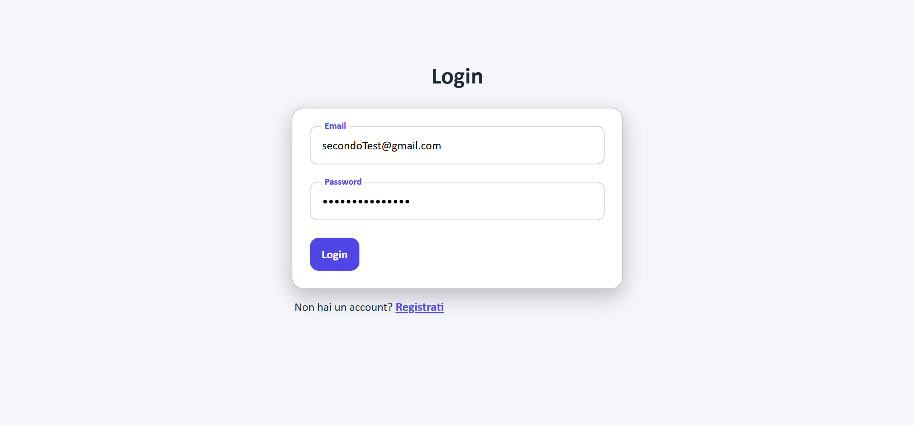
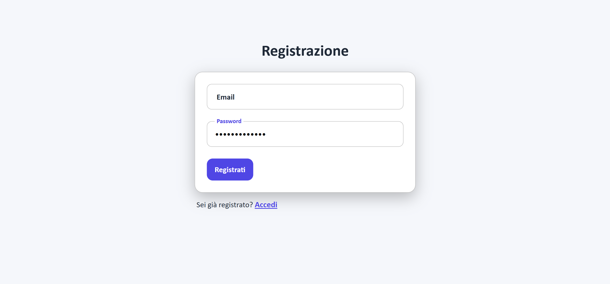
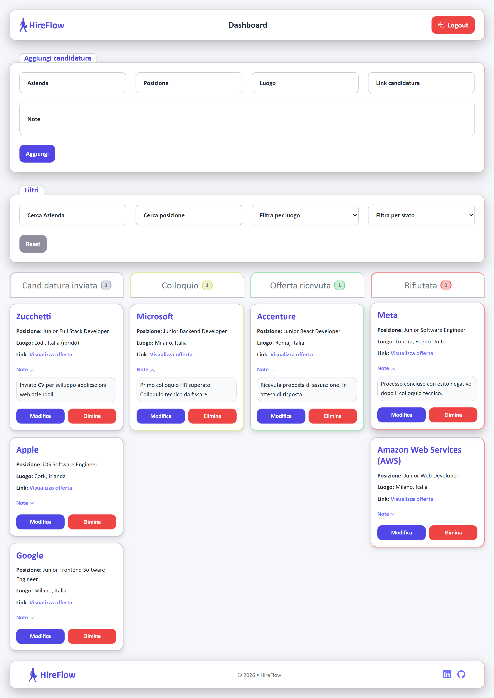
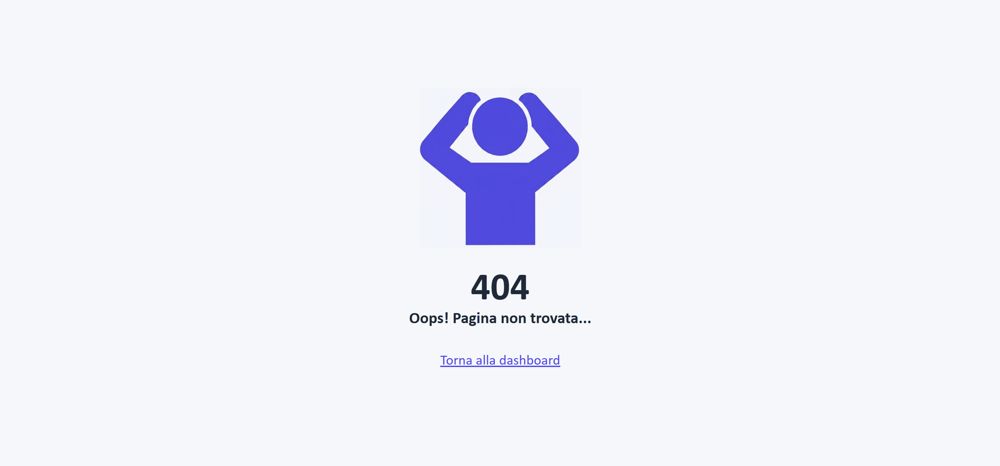
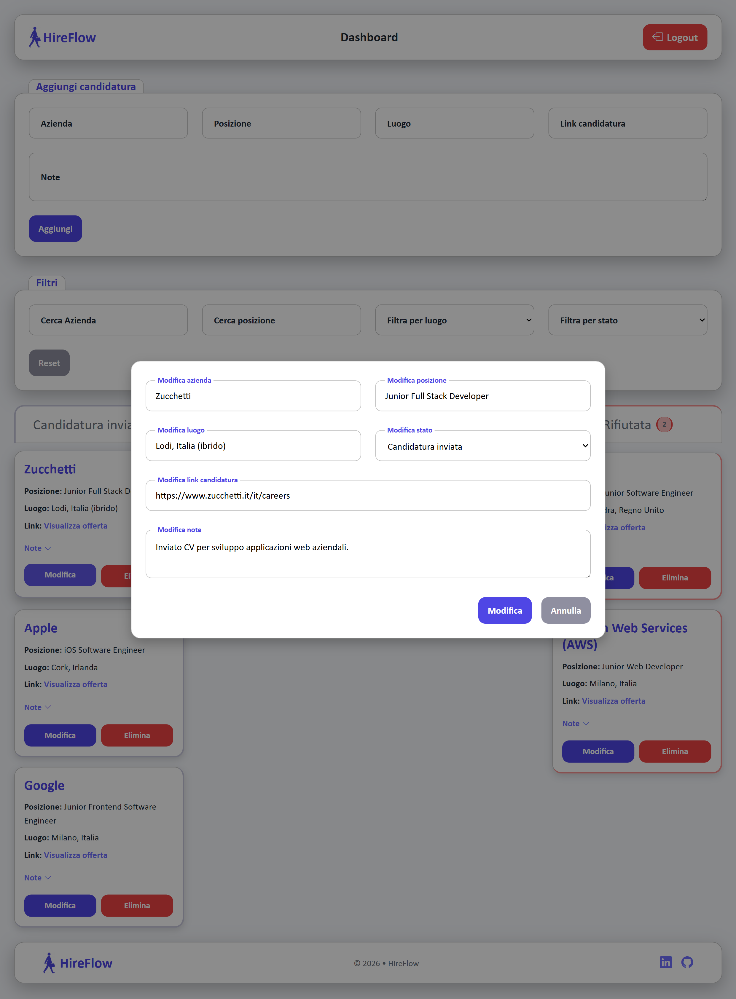
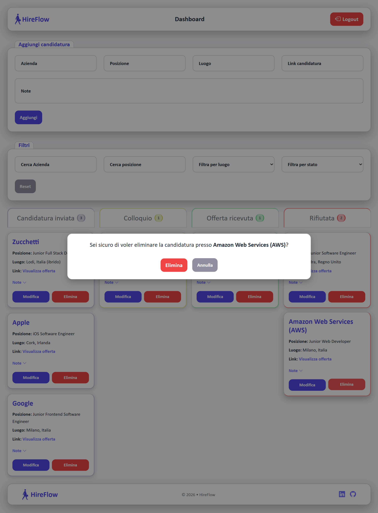

# 💼 HireFlow

A full stack application for managing job applications through a Kanban-style dashboard.

## Features

- User registration and authentication with JWT
- Create, edit, and delete job applications
- Kanban board organized by application status
- Track application progress:
  - Applied
  - Interview
  - Offer
  - Rejected
- Search applications by company and role
- Filter applications by location and status
- Add notes and job links to each application
- Responsive layout for desktop, tablet, and mobile
- User-specific data management

## Tech Stack

### Frontend
- React
- JavaScript
- CSS
- Bootstrap Grid
- React Router
- Context API

### Backend
- Node.js
- Express
- MySQL
- JWT Authentication
- bcrypt

## Project Architecture

The project follows a separated frontend/backend architecture.

### Frontend

Main pages → Authentication and Dashboard views

Components → Reusable UI components:
- Application cards
- Forms
- Filters
- Modals
- Layout components

Context → Global authentication state management

Services → API communication layer

### Backend

Controllers → Business logic

Routes → API endpoints

Middlewares → Authentication and request handling

Database → MySQL relational data storage


## Folder Structure

```

hire_flow/
│
├── backend/
│   ├── config/
│   ├── controllers/
│   ├── middlewares/
│   ├── routes/
│   └── server.js
│
├── frontend/
│   └── src/
│       ├── assets/
│       ├── components/
│       ├── contexts/
│       ├── pages/
│       ├── services/
│       ├── App.jsx
│       ├── index.css
│       └── main.jsx
│
├── screenshots/
│   ├── login.png
│   ├── register.png
│   ├── dashboard.png
│   ├── edit_modal.png
│   ├── delete_modal.png
│   └── 404.png
|
└── README.md

```

## Project Context

HireFlow was developed as a personal full stack project to consolidate and apply web development skills in a realistic scenario.

The goal was to build a complete application that combines frontend, backend, database management, and authentication, creating a practical tool to organize and track job applications.

Key aspects covered:

- Designing a complete application architecture
- Building REST APIs with authentication and protected routes
- Managing user-specific data with a relational database
- Creating a responsive React interface with reusable components
- Handling real-world CRUD operations and application states

## Visual Overview


|               Login               |                Register                 |
| :-------------------------------: | :-------------------------------------: |
|  |  |

|                  Dashboard                |              404 Page              |
| :---------------------------------------: | ---------------------------------: |
|  |  |

|           Edit Application Modal            |            Delete Confirmation Modal            |
| :-----------------------------------------: | :---------------------------------------------: |
|  |  |